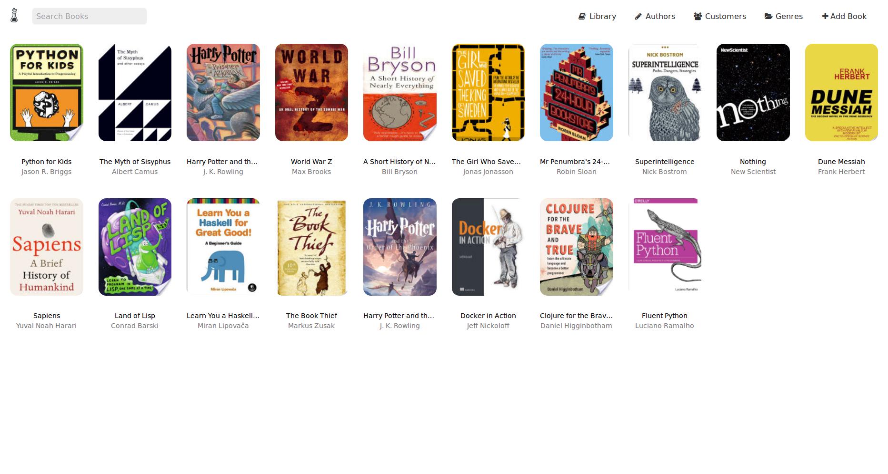

# FlaskBerry

Simple library software built using:
- Flask
- Tachyons
- Pony ORM

*Still very much WIP*

## Install Dependencies

    virtualenv -p path/to/python/installation venv
    source venv/bin/activate
    pip install -r requirements.txt

## Setup Database

    python populate_db.py

## Screenshot

